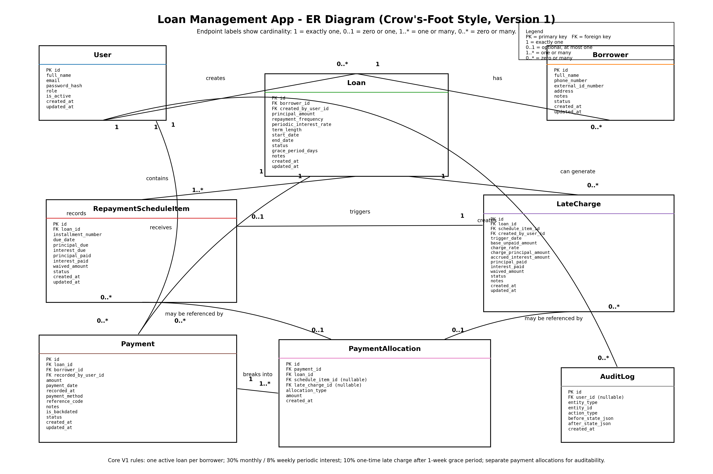

# ER Diagram

This document shows the Version 1 entity-relationship model for the loan management system.

## Main entities
- User
- Borrower
- Loan
- RepaymentScheduleItem
- Payment
- PaymentAllocation
- LateCharge
- AuditLog
